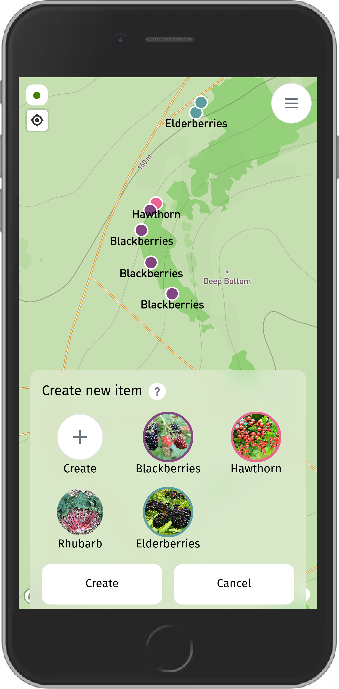
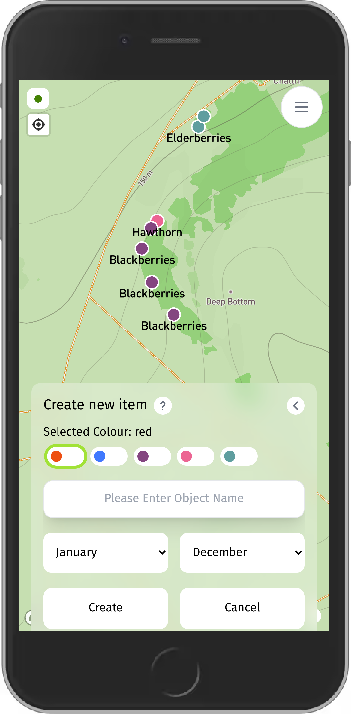
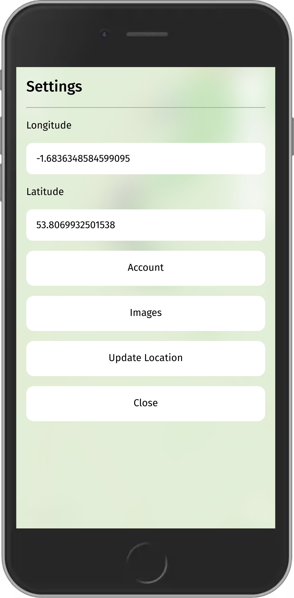
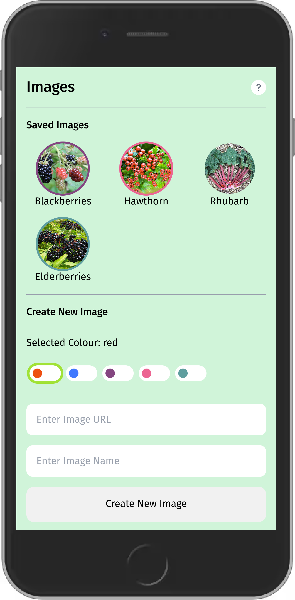

# Forager

Forager is a web based application for mapping publicly accessible foods.

Foragers current functionality includes:

- Pinning locations of interest as dots
- Clustered areas when zoomed out
- Adding images(URLS)
- Setting a home location

Forager utilises the below software stack:

- [Vue 3](https://v3.vuejs.org/)
- [Tailwind](https://tailwindcss.com/)
- [Mapbox](https://www.mapbox.com/)
- [Pocketbase](https://github.com/pocketbase/pocketbase)

All pinned locations are stored via [Pocketbase](https://github.com/pocketbase/pocketbase).

## Disclaimer

    Please be aware of and follow all applicable laws for
    where ever you may be foraging. I am not responsible for 
    any trespassing that may occur during the usage of this application, 
    nor any other legal issues you may face.

    Foraging can be a hazardous endeavour; Ensure you are aware of
    your surroundings at all times. I am not responsible for any
    injury that may occur, be it through the act of foraging, consuming
    foraged foods, or any other activity.

## Screenshots

### Add Markers

 

### Alternative Add Markers

 

### Settings Menu

 

### Images Menu

 

## Installation

### Prebuilt Binary Installation

You can install Forager with the provided binaries available on the [releases](https://github.com/CRBroughton/Forager/releases) page.

This binary will provide both the back-end and front-end of the application.

For deployment of the application, see [Pocketbases Going to Production documentation](https://pocketbase.io/docs/going-to-production/).

## Manual Installation

Regardless of manual installation method, you will require the following to build Forager:

- npm
- pnpm
- go 1.20+ (this is version Forager is built against)
- [taskfile](https://taskfile.dev/) - Automates the build process

Forager can then be installed via the following methods:

### Single binary installation

Following Pocketbase's philosophy, Forager can be installed as a single binary,
which will include all of the application (minus the database, which is generated on first start-up).

To install Forager using this method, perform the following actions:

- Clone this repository
- `cd` into the repository and run `pnpm i`
- Run `task linux64` to build the linux64 binary; Check out the
taskfile.yml file for various architectures, or to create all, simply
run `task build`.

### Separated installation

You can install Forager using a more traditional setup, with the compiled front-end
assets served through a reverse-proxy like NGINX, and a hosted instance of [Pocketbase](https://github.com/pocketbase/pocketbase).

You can deploy the built front-end via Netlify, or any other deployment option
that supports static pages.

You can utilise Pocketbase via a domain you own; Check [Pocketbases Going to Production documentation](https://pocketbase.io/docs/going-to-production/).

### Development

Development of Forager requires:

- An active Mapbox account and API key
- A Pocketbase server
- All of the previously mentioned software requirements

Dependant on your operating system's architecture, download the latest release of
[Pocketbase](https://github.com/pocketbase/pocketbase) and extract the executable
into the db folder. When running `pnpm run pocketbase:serve` for the first time,
the database migrations will ensure the correct tables are created.

## Progressive Web Application (PWA)

Forager is a Progressive Web Application (PWA), and therefore can be installed via any browser, however requires an active connection to your [Pocketbase](https://github.com/pocketbase/pocketbase) instance.

## FAQ

### Do you provide an official Forager instance?

I do not currently run an official instance of Forager. If there is a demand for this,
it could happen though.

### Where is the old version of Forager?

The previous version of Forager was an entirely offline application, 
however this version lacked in features and was
somewhat buggy, therefor has been replaced with this version.

If you are interested in this version, checkout the master branch and checkout
the last commit from 2021.